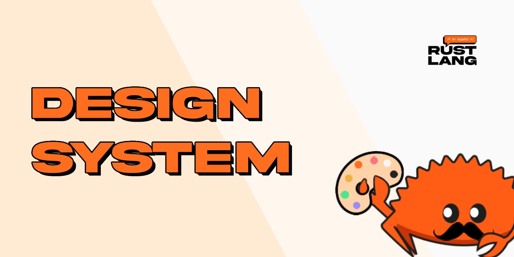
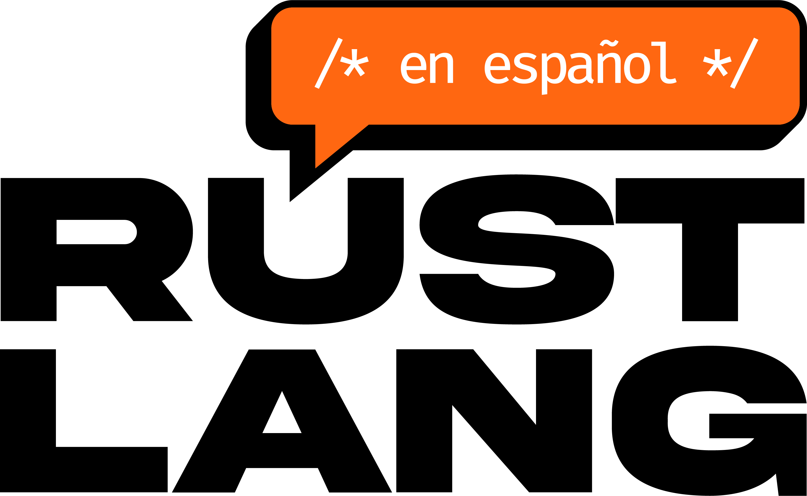

<div align="right">
    <a href="./README.EN.md"> :us: EN </a>
</div>



## :rocket Introducción

El Design System de RustLangES es la fuente única de verdad para los componentes UI en los proyectos de la comunidad Rust en español. Proporciona componentes accesibles, consistentes y de alta calidad para múltiples tecnologías.

## :package: Instalación

```bash
# Para proyectos React
pnpm add @rustlanges/react

# Para proyectos Leptos (Rust)
cargo add rustlanges-leptos
```

## :sparks: Características principales

- **Multi-framework**: Soporte para React, Leptos y más
- **Modo claro/oscuro**: Compatibilidad automática con el tema del sistema
- **Accesibilidad**: Componentes WCAG 2.1 AA compliant
- **Sistema de diseño**: Basado en [Figma](https://www.figma.com/design/S9yCZSaZ9q54XSojWNhJft/Rust-Lang-ES)

## :building_construction: Estructura del proyecto

```
.
├── crates/          # Componentes Rust
└── js/              # Componentes JavaScript
```

## :art: Uso de componentes

### React
```tsx
import { Button, TelegramIcon } from "@rustlanges/react";

function App() {
  return (
    <Button 
      variant="primary"
      icon={<TelegramIcon />}
      label="Enviar"
    />
  );
}
```

### Leptos
```rust
use rustlanges_leptos::components::Button;

view! {
    <Button variant=ButtonVariant::Primary>
        "Hola Rust!"
    </Button>
}
```

## :paintbrush: Sistema de diseño

Todos los componentes siguen las especificaciones de nuestro [Figma oficial](https://www.figma.com/design/S9yCZSaZ9q54XSojWNhJft/Rust-Lang-ES):

- :triangular_ruler: [Guías de diseño](https://www.figma.com/file/S9yCZSaZ9q54XSojWNhJft/Rust-Lang-ES?node-id=0%3A1)
- :art: [Paleta de colores](https://www.figma.com/file/S9yCZSaZ9q54XSojWNhJft/Rust-Lang-ES?node-id=1%3A2)
- :pencil2: [Iconografía](https://www.figma.com/file/S9yCZSaZ9q54XSojWNhJft/Rust-Lang-ES?node-id=24-117)

## :hammer_and_wrench: Desarrollo

1. Clona el repositorio:
```bash
git clone https://github.com/rustlanges/design-system.git
cd design-system
```

2. Instala dependencias:
```bash
pnpm install
```

3. Inicia el entorno de desarrollo:
```bash
pnpm run dev
```

## :handshake: Cómo contribuir

Sigue nuestra [guía de contribución](CONTRIBUTING.ES.md) para:
- :new: Añadir nuevos componentes
- :bug: Reportar errores
- :sparks: Proponer mejoras

**Importante**: Todos los componentes deben:
1. Seguir las especificaciones de Figma
2. Pasar los tests de accesibilidad
3. Incluir documentación

## :page_facing_up: Licencia

Este proyecto está licenciado bajo **MIT License** - ver el archivo [LICENSE](./LICENSE) para más detalles.

---

<div align="center">
  
  <p>Parte del ecosistema RustLangES</p>
</div>
